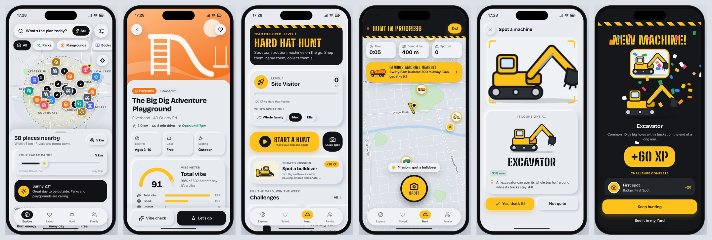

# Playdar

**Find the good stuff nearby.** Playdar helps parents find something to do with their kids right now: parks, playgrounds, bookshops, splash pads, museums, kid-friendly cafés and local events, on a map with a range you can widen from "round the corner" to "day trip". Every place carries a **Vibe Meter**, built from one question parents answer after a visit: *was it a vibe?*

It also ships **Hard Hat Hunt**, a game for the car ride: kids spot construction machines, snap a photo, the app identifies the machine, they name it, and it joins their collection. Other families vote on the best names and can go and find famous machines in real life.



- **iOS and Android** from one codebase (Expo SDK 57, React Native 0.86, TypeScript).
- **Web build** of the same app runs as an interactive prototype (it powers the claude.ai artifact).
- Design: "Uber meets neumorphism". Soft extruded surfaces, bold ink actions, safety-yellow accent, light and dark themes.

## Try it

**On your phone (fastest):**

```bash
npm install
npx expo start
```

Scan the QR code with the **Expo Go** app (iOS or Android). Choose *Use my location* during setup to load real places near you from OpenStreetMap, or *Explore the demo town*.

**In a browser:** `npx expo start --web`, or build the single-file prototype with `npm run build:artifact` (writes `dist/artifact/playdar.html`).

## What's in the app

| Area | Features |
| --- | --- |
| Explore | Map with category chips, radar range slider (1–50 km), filters (free, open now, indoor/outdoor, ages, must-haves), quick ideas (Burn energy, Rainy day, Free, Close by, Little ones, Calm), weather tip, featured partners, events this week, list sorted for you |
| Places | Cover art, distance and travel time, Vibe Meter with vote breakdown and top tags, amenities, hours, events, parent tips, partner offers, directions |
| Vibe check | One tap (Not a vibe → Total vibe), what stood out, who came, an optional tip. Posted as "Parent of 2", never names |
| Ask Playdar | Plain-English search ("somewhere shady with toilets for a 2-year-old"), answered by Claude from the places in range |
| Saved | Favourites, Want to try, Rainy day lists; your vibe checks |
| Hard Hat Hunt | Start a hunt (trail, timer, famous-machine alerts), snap and identify machines, name them, XP and levels, the Yard collection (20 machines), daily mission, weekly Digger Bingo, Family Race to 10, badges, name voting, find famous machines, weekly leaderboard |
| Family | Kids (ages only drive suggestions), team name, theme, units, data source, sharing, venue sign-up, privacy & safety |

## Project layout

```
App.tsx                  providers, navigation, app shell
src/
  theme/                 tokens, neumorphic depth presets, typography, theme provider
  ui/                    design-system primitives (Surface, Button, Chip, Sheet, Slider…)
  art/                   generated cover art, 20 machine illustrations, logo
  data/                  categories, vehicles, challenges, demo town + sample community
  domain/                pure logic: geo, search & ranking, vibe scoring, opening hours, game rules
  state/                 zustand stores (settings, places, hunt) + data providers
  services/              location, camera, AI, OpenStreetMap import, weather, backends
  map/                   AppMap.tsx (native maps) and AppMap.web.tsx (stylised SVG town)
  navigation/            stack (native) / stack.web (animated JS stack), tab bar
  screens/               explore, place, saved, hunt, profile, onboarding
  shell/                 AppShell.web draws the phone frame on wide screens
supabase/                Postgres schema (RLS, PostGIS) and Claude-powered edge functions
scripts/build-artifact.mjs   bundles the web build into one HTML file
docs/                    product spec, architecture, screenshots
```

Platform-specific code uses React Native file extensions: `foo.tsx` is the native implementation and `foo.web.tsx` replaces it in the web build.

## Scripts

| Command | What it does |
| --- | --- |
| `npm start` | Expo dev server (Expo Go, simulators, web) |
| `npm run typecheck` | TypeScript, whole app |
| `npm run check:native` | Bundles iOS and Android to catch native-only import problems |
| `npm run build:web` | Static web export to `dist/web` |
| `npm run build:artifact` | Single-file web prototype in `dist/artifact/playdar.html` |

## Data and backends

The app runs fully on the device with no setup. Three backends plug in behind one interface (`src/services/backend`):

1. **On-device demo** (default): your data stays on the phone; sample families fill the leaderboard and famous machines.
2. **claude.ai artifact runtime**: when the web build runs as an artifact, spots, name votes, vibe checks and the leaderboard are shared between everyone who opens it, and Claude identifies photos.
3. **Supabase** (production): set `EXPO_PUBLIC_SUPABASE_URL` and `EXPO_PUBLIC_SUPABASE_ANON_KEY` (see `.env.example` and [supabase/README.md](supabase/README.md)).

Places come from the **Riverbend demo town** (fictional, for previews) or, in live mode, **OpenStreetMap** via the Overpass API (free, worldwide). Map data © OpenStreetMap contributors.

## Privacy and safety

Kids never have accounts. Shared machines show a location rounded to about 150 m (rounded again on the server). Photos are checked for people and kept private if any are found, and public photos wait for moderation in the Supabase backend. Partner venues are labelled and never change ratings or the order of results. More in [docs/PRODUCT.md](docs/PRODUCT.md).

## Before the app stores

- Replace `REPLACE_WITH_ANDROID_GOOGLE_MAPS_KEY` in `app.json` (Google Maps on Android release builds).
- Set real bundle identifiers if `app.playdar.mobile` isn't yours.
- Build with EAS: `npx eas-cli@latest build --platform all`.
- Write the privacy policy and age-rating answers (COPPA / GDPR-K: the app targets parents, not children).

See [docs/ARCHITECTURE.md](docs/ARCHITECTURE.md) for how it fits together and [docs/PRODUCT.md](docs/PRODUCT.md) for the product spec, game rules, business model and roadmap.
